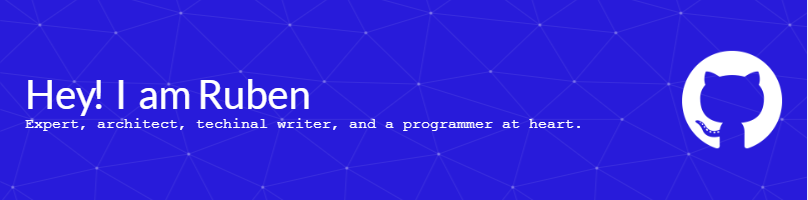

### 👋 Hi there! I'm Ruben

I'm a **Senior Solution Architect**, **Technical Writer**, and **Programmer** with a passion for building innovative, robust, and scalable systems. I thrive on solving complex challenges and sharing knowledge through clear, comprehensive documentation.

  

---

🤔 **About Me:**  
My journey in technology is fueled by a desire to solve complex problems and contribute to projects that push boundaries. Whether it's architecting scalable systems, crafting insightful documentation, or diving deep into code, I approach each task with enthusiasm and a commitment to excellence.

🌟 **Currently Showcasing:**  
I enjoy building and sharing projects that reflect my learning journey and experiments with new technologies. You'll find a mix of practical applications and explorations of innovative concepts.

## 🚀 My Toolkit:

Here are some of the technologies I work with regularly:

  
  
  
  
  
  
  
  
  
  
   
  
   

## 🌟 What I'm Up To:

- 🔭 **Currently working on:** Architecting and developing cloud-native solutions at BCS HR, primarily using **.NET, C#, and Azure**.
- 🌱 **Lifelong Learner:** Continuously exploring new technologies, with a current focus on advanced AI techniques, distributed systems.
- 🤝 **Open to Collaboration:** Eager to connect on projects related to **Cloud Architecture**, **AI/ML Engineering**, and **Cryptography**. Let's build something amazing together!
- 💬 **Ask me anything about:** **C#/.NET**, **Go**, **System Design**, or **Technical Writing**. I'm always happy to share what I know!

## 📫 Let's Connect

<!-- Social Media Links -->

  
  
  
  
  

## 📊 My GitHub Stats

<!-- GitHub Stats -->

  
  
  

<!--
**knuijver/knuijver** is a ✨ _special_ ✨ repository because its `README.md` (this file) appears on your GitHub profile.

Here are some ideas to get you started:

- 🔭 I’m currently working on ...
- 🌱 I’m currently learning ...
- 👯 I’m looking to collaborate on ...
- 🤔 I’m looking for help with ...
- 💬 Ask me about ...
- 📫 How to reach me: ...
- 😄 Pronouns: ...
- ⚡ Fun fact: ...
-->
